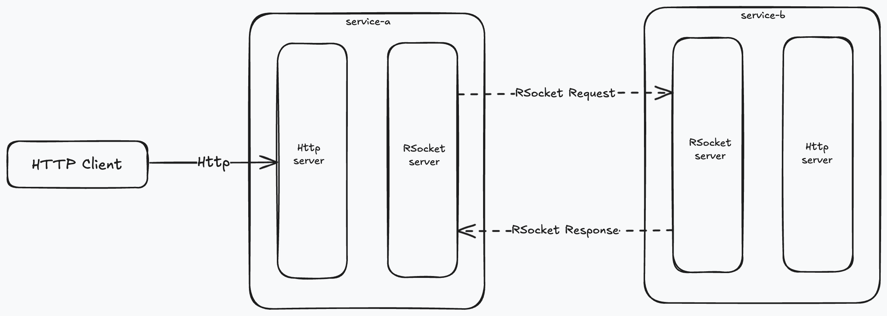

# rsocket-micro-connect

This project enables services to maintain compatibility with HTTP-based RPC communication (using JSON) while incorporating RSocket to take advantage of its advanced features and capabilities. It serves as a compelling alternative to OpenFeign or WebClient, which are commonly employed for HTTP-based remote procedure calls (RPC) within Spring Boot or Spring Cloud frameworks.

The calls diagram between services is:


### Instructions

* Autoconfiguration for both server RSocket and client RSocket.
* Using RSocket connector similarly to HTTP client with annotations like `@RequestParam`, `@RequestBody`, etc.
* Automatic logging for both server RSocket and client RSocket.
* This repository <b>MUST</b> be used alongside `spring-boot-starter-webflux`

* Client Side Dependency

```xml
<dependency>
    <groupId>pro.chenggang</groupId>
    <artifactId>rsocket-micro-connect-client-starter</artifactId>
    <version>${LATEST_VERSION}</version>
</dependency>
```

* Server Side Dependency

```xml
<dependency>
    <groupId>pro.chenggang</groupId>
    <artifactId>rsocket-micro-connect-server-starter</artifactId>
    <version>${LATEST_VERSION}</version>
</dependency>
```

#### Normal Usage

##### Server Side

* Configure the Port for an RSocket Server
    * By default, Spring uses TCP as the transport protocol for RSocket.
    * You can also configure any properties supported by `spring-boot-starter-rsocket`.

```yaml
spring:
  rsocket:
    server:
      port: 23408
```

* Define an RSocket class or use an existing REST controller class, then add the annotation [@RSocketMicroEndpoint](rsocket-micro-connect-spring/src/main/java/pro/chenggang/project/rsocket/micro/connect/spring/annotation/RSocketMicroEndpoint.java) to it.
* Use `@MessageMapping` (`org.springframework.messaging.handler.annotation.MessageMapping`) on the method you want to expose as a RSocket endpoint.
    * You can define a RSocket path using `@MessageMapping#value`, similar to an HTTP path.
      ```java
      @MessageMapping("/server/rsocket/path")
      public Mono<String> getData() {
          return Mono.just(extraHeader);
      }
      ```
    * If there is a `@RequestMapping` or any REST mapping like `@PostMapping` on the endpoint method, you can also expose a RSocket endpoint using the path of `@RequestMapping`.
      ```java
      @MessageMapping
      @RequestMapping("/server/rsocket/path")
      // OR @PostMapping("/server/rsocket/path")
      public Mono<String> getData() {
          return Mono.just(extraHeader);
      }
      ```
    * If paths are defined in both `@MessageMapping` and `@RequestMapping`, the value of `@MessageMapping` will be used.
      ```java
      @MessageMapping("/server/rsocket/path/will-be-used") // this path will be used as RSocket's endpoint.
      @RequestMapping("/server/rsocket/path/will-not-be-used")
      public Mono<String> getData() {
          return Mono.just(extraHeader);
      }
      ```
* Then you can start the server application.

##### Client Side

* Define an interface with the annotation [@RSocketMicroConnector](rsocket-micro-connect-spring/src/main/java/pro/chenggang/project/rsocket/micro/connect/spring/annotation/RSocketMicroConnector.java).
* Configure the address of the RSocket server in `@RSocketMicroConnector#value`, which should match the transport protocol of the RSocket server:
    * `ws://server-host:server-port` for WebSocket transport
    * `wss://server-host:server-port` for secure WebSocket transport
    * `tcp://server-host:server-port` for TCP transport
* Use `@MessageMapping` or `@RequestMapping` to define the RSocket request path.
* Supported annotations:
    * [x] `@PathVariable`
    * [x] `@RequestParam`
    * [x] `@RequestBody`
    * [x] `@RequestHeader`
    * [x] [@RequestPartName](rsocket-micro-connect-spring/src/main/java/pro/chenggang/project/rsocket/micro/connect/spring/annotation/RequestPartName.java): used in file-uploading scenarios to propagate the uploading file's name to the server.
* Full example of a connector:

```java
@RSocketMicroConnector("tcp://127.0.0.1:23408")
public interface SimpleRSocketMicroConnector {

    @MessageMapping("/server/data/path-variable/{variable}")
    Mono<String> getSingleData(@PathVariable("variable") String variable);

    @RequestMapping("/server/data/query-variable")
    Mono<String> getMultiData(@RequestParam("var1") String variable1, @RequestParam("var2") String variable2);

    @MessageMapping("/server/data/body")
    Mono<String> sendBodyData(@RequestBody BodyValue bodyValue);

    @MessageMapping("/server/data/stream")
    Flux<String> getStreamData(@RequestHeader HttpHeaders headers);

    @MessageMapping("/server/data/stream/auto-header")
    Flux<String> getStreamDataAutoHeader();

    @MessageMapping("/server/data/extra-header")
    Mono<String> getExtraHeader(@RequestHeader(name = "x-extra-header") String extraHeader);

    @RequestMapping("/server/data/file-upload")
    Mono<String> uploadFile(@RequestPartName String name, Flux<DataBuffer> dataBufferFlux);
}
```

* Then you can use the bean of the defined interface in your Spring application.

#### While Using RSocket with Discovery like Eureka or Nacos

##### Server Side

The server side configuration is the same as the configuration of [simple-server-side](#server-side).

##### Client Side

* Configure `load-balance` support in your YAML configuration:
    * Enable RSocket load balancing.
      ```yaml
      rsocket-micro-connect:
        client:
          enable-discover: true
      ```
    * Configure the refresh interval for the load balancer, with a default refresh interval of `10S`.
      ```yaml
      rsocket-micro-connect:
        client:
          refresh-discover-interval: PT10S
      ```

* The connector configuration is the same as the configuration of [simple-client-side](#client-side), but the host of the RSocket server is different:
    * The host of the RSocket Server should be the service name registered in discovery:
        * `tcp://some-service-a`
        * `ws://some-service-b`
        * `wss://some-service-c`
* The RSocket server port ought to be configured within the instance's metadata during the discovery registration process. In Nacos Discovery, the metadata can be configured through the web editor.
  ```yaml
  metadata:
    "rsocket-micro-connect.port": 23408 # the port of RSocket instance
    "rsocket-micro-connect.enable": true # if this instance can be used in RSocket's load-balancer
  ```
  If either `"rsocket-micro-connect.enable": true` or `"rsocket-micro-connect.port"` is not configured within the instance's metadata, the client will be unable to utilize the server instance for RSocket load balancing.

* Then you can use the bean of the defined interface in your Spring application as usual.

#### File Uploading Example

* Server Side:

```java
@RSocketMicroEndpoint
public class ServerController {

    @MessageMapping("/server/data/file-upload")
    public Flux<String> getData(@RequestPartName String partName, Flux<DataBuffer> dataBufferFlux) {
        String userDir = System.getProperty("user.dir");
        String savedFilePath = userDir + File.separator + partName;
        return DataBufferUtils.write(dataBufferFlux, Paths.get(savedFilePath), StandardOpenOption.CREATE_NEW)
                .thenMany(Mono.defer(() -> {
                    return Mono.fromCallable(() -> {
                                File savedFile = new File(savedFilePath);
                                long length = savedFile.length();
                                savedFile.deleteOnExit();
                                return length;
                            })
                            .map(length -> partName + ":" + length);
                }));
    }
}
```

* Client Side:

```java
@RSocketMicroConnector("tcp://127.0.0.1:23408")
public interface SimpleRSocketMicroConnector {

    @RequestMapping("/server/data/file-upload")
    Mono<String> uploadFile(@RequestPartName String name, Flux<DataBuffer> dataBufferFlux);
}
```

* The `@RequestPartName` is optional if you just want to send `DataBuffer` to the server.

* Examples:
    * [server-side](connect-example-server/src/main/java/pro/chenggang/project/rsocket/micro/connect/example/server/controller/ServerController.java)
    * [client-side](connect-example-client/src/main/java/pro/chenggang/project/rsocket/micro/connect/example/client/connector/SimpleRSocketMicroConnector.java)
    * [client-side-test](connect-example-client/src/test/java/pro/chenggang/project/rsocket/micro/connect/example/client/controller/SimpleClientControllerTest.java)

### Customizations

* Customize client connector's execution:

Using [RSocketMicroConnectorExecutionCustomizer](rsocket-micro-connect-spring/src/main/java/pro/chenggang/project/rsocket/micro/connect/spring/proxy/RSocketMicroConnectorExecutionCustomizer.java) as a bean.

This is useful for customizing connector execution globally, such as propagating HTTP headers from the HTTP context to the RSocket context.

```java
@Configuration(proxyBeanMethods = false)
public class RSocketMicroConnectorConfiguration {

    @Bean
    public RSocketMicroConnectorExecutionCustomizer autoPropagateHeadersCustomizer() {
        // This will automatically propagate ServerWebExchange from WebFlux's Context to RSocket Connector.
        return connectorExecution -> {
            return Mono.deferContextual(contextView -> {
                        return Mono.justOrEmpty(contextView.getOrEmpty(ServerWebExchangeContextFilter.EXCHANGE_CONTEXT_ATTRIBUTE))
                                .ofType(ServerWebExchange.class)
                                .switchIfEmpty(Mono.error(new IllegalStateException("No ServerWebExchange found in context")));
                    })
                    .flatMap(serverWebExchange -> {
                        return Mono.fromRunnable(() -> connectorExecution.addHeaders(serverWebExchange.getRequest()
                                .getHeaders()));
                    });
        };
    }
}
```

* Server side configuration properties can be found at [RSocketMicroConnectServerProperties.java](rsocket-micro-connect-spring/src/main/java/pro/chenggang/project/rsocket/micro/connect/spring/server/RSocketMicroConnectServerProperties.java).
* Client side configuration properties can be found at [RSocketMicroConnectClientProperties.java](rsocket-micro-connect-spring/src/main/java/pro/chenggang/project/rsocket/micro/connect/spring/client/RSocketMicroConnectClientProperties.java).

* If you want to configure the Load-balance Strategy of RSocket, you can define an implementation of [RSocketLoadBalanceStrategies.java](rsocket-micro-connect-spring/src/main/java/pro/chenggang/project/rsocket/micro/connect/spring/client/loadbalance/RSocketLoadBalanceStrategies.java) as a bean. The default implementation is [DefaultRSocketLoadBalanceStrategies.java](rsocket-micro-connect-spring/src/main/java/pro/chenggang/project/rsocket/micro/connect/spring/client/loadbalance/DefaultRSocketLoadBalanceStrategies.java), which uses `RoundRobinLoadbalanceStrategy` as the RSocket Load-balance Strategy by default.

### Advanced Usages

* There are three interceptors in both `rsocket-micro-connect-client-starter` and `rsocket-micro-connect-server-starter`. These interceptors can also implement the `Ordered` interface for configuring the sequence of the interceptor execution.
* The interceptors are:
    * [RSocketExecutionBeforeInterceptor.java](rsocket-micro-connect-core/src/main/java/pro/chenggang/project/rsocket/micro/connect/core/api/RSocketExecutionBeforeInterceptor.java)
        * This interceptor executes before the actual RSocket execution and invokes in natural order.
    * [RSocketExecutionAfterInterceptor.java](rsocket-micro-connect-core/src/main/java/pro/chenggang/project/rsocket/micro/connect/core/api/RSocketExecutionAfterInterceptor.java)
        * This interceptor executes after the completion of the actual RSocket execution and invokes in <b>REVERSE</b> order.
    * [RSocketExecutionUnexpectedInterceptor.java](rsocket-micro-connect-core/src/main/java/pro/chenggang/project/rsocket/micro/connect/core/api/RSocketExecutionUnexpectedInterceptor.java)
        * This interceptor executes after any error signals or resource clean-up of the actual RSocket execution and invokes in natural order.
